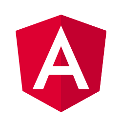
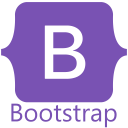
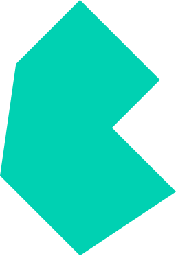
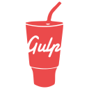

<!-- HEADER -->
<h1 align="center">Hi 👋, I'm @DikurikuDev</h1>
<h3 align="center">A Senior Casual Gamer</h3>
<!-- /HEADER -->

<!-- GENERAL_INFO -->
- 🌱 I’m currently learning **front-end and game modding development, also CS stuff**
- 📫 Reach me at **dikuriku.dev@gmail.com**
- 💬 Ask me about anything **I am happy to help**
<!-- /GENERAL_INFO -->

<!-- INTRODUCTION -->
The main goal of this account is to give some love back to the community, especially the game modding and Stack Exchange communities.

I have some mods I want to do. And others that are half-baked in HDs somewhere that I want to finish. However, if you have an open-source project that I could help with, reach me. I will try to block some time to collaborate.

If you have a mod idea for a game that I already have a mod, contact me, I might have an interest in doing it. My rules for mods are:

- Simple-player/non-competitive games;
- No cheating or making the game too easy. The exception is memory-aid tools;
- Keep the design/look-and-feel of the original game, something that could be a DLC;
<!-- /INTRODUCTION -->

<!-- ICONS -->
<h3 align="left">Languages and Tools:</h3>

  
  
  
  
  
  
  
  
  
  
  
  
  
  
  
  
  
   
  
  
  
  
  

<h3 align="left">Connect with me:</h3>

  
  
  
  
  
  

<h3 align="left">Support:</h3>

  

<!-- /ICONS -->
